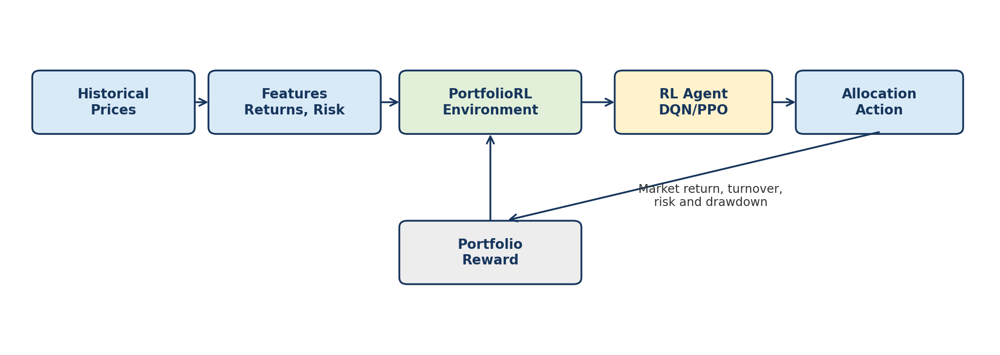

# REINFORCEMENT LEARNING

# *PortfolioRL: Reinforcement Learning for Dynamic Portfolio Rebalancing*


## Table of Contents

1. [Research / Business Goal](#1-research--business-goal)
   1.1 [Business Problem](#11-business-problem)
   1.2 [Research Goal](#12-research-goal)
   1.3 [Expected Business Value](#13-expected-business-value)
2. [Discussion of the Identified RL Problem](#2-discussion-of-the-identified-rl-problem)
   2.1 [Agent](#21-agent)
   2.2 [Environment](#22-environment)
   2.3 [State Space](#23-state-space)
   2.4 [Action Space](#24-action-space)
   2.5 [Reward Function](#25-reward-function)
   2.6 [Transition and Episode](#26-transition-and-episode)
   2.7 [Why Reinforcement Learning Is Appropriate](#27-why-reinforcement-learning-is-appropriate)
3. [Mathematical Foundations, Algorithm Selection, and Hyperparameter Tuning Plan](#3-mathematical-foundations-algorithm-selection-and-hyperparameter-tuning-plan)
   3.1 [Markov Decision Process Formulation](#31-markov-decision-process-formulation)
   3.2 [From Tabular Q-Learning to Deep Q-Networks](#32-from-tabular-q-learning-to-deep-q-networks)
   3.3 [Algorithm Justification and Alternatives Considered](#33-algorithm-justification-and-alternatives-considered)
   3.4 [Dataset(s)](#34-datasets)
   3.5 [Hyperparameter Tuning Plan](#35-hyperparameter-tuning-plan)
4. [Performance Evaluation Metrics](#4-performance-evaluation-metrics)
   4.1 [Evaluation Principles](#41-evaluation-principles)
   4.2 [Return Metrics](#42-return-metrics)
   4.3 [Risk and Downside Metrics](#43-risk-and-downside-metrics)
   4.4 [Risk-Adjusted Performance Metrics](#44-risk-adjusted-performance-metrics)
   4.5 [Trading Efficiency and Practicality](#45-trading-efficiency-and-practicality)
   4.6 [Reinforcement-Learning Training Metrics](#46-reinforcement-learning-training-metrics)
   4.7 [Benchmark and Relative-Performance Metrics](#47-benchmark-and-relative-performance-metrics)
   4.8 [Evaluation Protocol](#48-evaluation-protocol)
   4.9 [Interpretation and Decision Criteria](#49-interpretation-and-decision-criteria)
5. [References](#5-references)

---

## 1. Research / Business Goal

### 1.1 Business Problem

Investors, wealth managers, robo-advisors, and financial institutions regularly rebalance investment portfolios to manage risk, preserve capital, and improve returns. Traditional portfolio strategies, such as fixed 60/40 allocation, equal-weight allocation, or monthly rebalancing, are simple and widely used. However, these strategies are usually static and may not adapt well to changing market conditions such as high volatility, market drawdowns, interest-rate changes, or shifts between growth and defensive assets.

For example, during a stable growth market, a portfolio may benefit from higher exposure to equities. During periods of market stress, the same portfolio may need to reduce equity exposure and increase allocation to defensive assets such as bonds, gold, or cash-like instruments. A fixed allocation rule does not explicitly learn from past market regimes or adapt its behavior to changing risk conditions.

### 1.2 Research Goal

The goal of this project is to develop and evaluate a reinforcement learning agent that learns how to dynamically rebalance a portfolio across multiple financial assets. The agent will observe market-related signals such as asset returns, volatility, momentum, drawdown, and current portfolio allocation. Based on these signals, it will select a portfolio allocation action with the objective of maximizing risk-adjusted returns while controlling transaction costs and limiting downside risk.

The proposed reinforcement learning strategy will be compared against traditional portfolio strategies, including buy-and-hold, equal-weight allocation, fixed 60/40 stock-bond allocation, and periodic rebalancing. The purpose is not to predict future prices directly, but to learn an adaptive allocation policy that can respond to historical market conditions in a simulated backtesting environment.

The learned policy will be benchmarked against the standard rule-based strategies it is meant to improve upon:

1. Buy-and-hold (a single broad-market position held for the full horizon).
2. Equal-weight portfolio, periodically rebalanced.
3. Fixed 60/40 stock–bond portfolio.
4. Calendar-based (monthly) rebalanced portfolio.

### 1.3 Expected Business Value

- Improved decision support for portfolio managers by learning allocation patterns from sequential market data.
- Better risk control by including volatility and drawdown penalties in the reward function.
- More realistic investment simulation by accounting for transaction costs and portfolio turnover.
- A measurable comparison against common rule-based strategies such as buy-and-hold and 60/40 allocation.

**Important scope note:** this project is for educational reinforcement learning research and historical backtesting only. It is not intended to provide investment advice or guarantee future market performance.

**Table 1.** Preliminary asset universe for the PortfolioRL environment.

| Asset Type | Example Ticker | Role in Portfolio | Why Included |
|---|---|---|---|
| U.S. equities | SPY | Growth asset | Captures broad U.S. stock market exposure. |
| Long-term bonds | TLT | Defensive asset | Provides interest-rate-sensitive fixed-income exposure. |
| Gold | GLD | Hedge asset | Can help diversify during stress or inflation regimes. |
| Short-term treasury/cash proxy | SHY or BIL | Low-risk asset | Represents a defensive or cash-like allocation. |

---

## 2. Discussion of the Identified RL Problem

Portfolio rebalancing can be modeled as a sequential decision-making problem. At each time step, the agent observes the current market state and decides how to allocate capital across the available assets. The decision made today affects future portfolio value, transaction cost, portfolio risk, and drawdown. This makes the problem suitable for reinforcement learning.

The reinforcement learning problem can be formulated as a Markov Decision Process (MDP), where the agent interacts with a market simulation environment over time and learns a policy that maximizes cumulative long-term reward.



*Figure 1. PortfolioRL reinforcement learning loop. The agent observes market features, selects an allocation, and receives a reward based on return, cost, risk, and drawdown.*

Figure 1 summarizes the interaction loop. Historical price data is transformed into market features. The environment exposes those features as the state. The RL agent chooses a portfolio allocation action, and the environment calculates the resulting portfolio return, transaction cost, risk, and drawdown before moving to the next time step.

**Table 2.** RL problem formulation for PortfolioRL.

| RL Component | Definition in PortfolioRL |
|---|---|
| Agent | An automated portfolio rebalancing agent that chooses asset allocations. |
| Environment | A historical market simulation built from asset price data and portfolio accounting logic. |
| State | Market signals and current portfolio information available before rebalancing. |
| Action | A portfolio allocation decision, such as defensive, balanced, or equity-heavy allocation. |
| Reward | Portfolio return adjusted by transaction cost, volatility penalty, and drawdown penalty. |
| Transition | The move from one trading period to the next after applying the selected allocation. |
| Episode | A complete backtesting period, such as several years of daily or weekly rebalancing steps. |
| Policy | The learned mapping from market states to portfolio allocation decisions. |

### 2.1 Agent

The agent represents an automated portfolio manager. Its task is to decide how the portfolio should be allocated across available assets at each rebalancing step. The agent does not directly forecast stock prices. Instead, it learns which allocation action tends to produce better long-term risk-adjusted results under different market conditions.

### 2.2 Environment

The environment is a historical market simulation. It provides the agent with market observations and calculates the result of each portfolio decision. At each step, the environment shows the current state, receives the agent action, applies the selected allocation to the next period asset returns, calculates portfolio value and risk measures, returns a reward, and advances to the next time step.

1. Provide the current market state to the agent.
2. Receive the agent portfolio allocation decision.
3. Apply the selected allocation to the next period asset returns.
4. Calculate portfolio return, turnover, transaction cost, volatility, and drawdown.
5. Return the reward to the agent and move to the next time step.

The simulator will be built from historical daily price data (e.g., retrieved with the `yfinance` Python library), converting prices into returns and the derived technical indicators that make up the state.

### 2.3 State Space

The state represents the information available to the agent before it makes a rebalancing decision. A practical state vector may include recent returns, rolling volatility, momentum, moving average ratios, current portfolio weights, and current drawdown.

**Table 3.** Candidate state variables for the PortfolioRL agent.

| State Variable | Description |
|---|---|
| Recent asset returns | Short-term performance of each asset over the last period. |
| Rolling volatility | Recent risk level of each asset, such as 20-day or 60-day volatility. |
| Momentum | Recent trend direction, such as cumulative return over a lookback window. |
| Moving average ratio | Current price compared with a moving average. |
| Current portfolio weights | The allocation currently held by the agent. |
| Portfolio drawdown | Current decline from the previous portfolio peak. |

Example state vector:

```
State_t = [returns, rolling_volatility, momentum, moving_average_ratios, current_weights, current_drawdown]
```

### 2.4 Action Space

To keep the first implementation manageable, the project will use a discrete action space. Each action corresponds to a predefined portfolio allocation. This allows the project to use algorithms such as Q-Learning or Deep Q-Networks. A future extension could use continuous action spaces where the agent directly outputs asset weights.

**Table 4.** Example discrete portfolio allocation actions.

| Action | Portfolio Allocation |
|---|---|
| 0 | 100% SHY or BIL — defensive cash-like allocation |
| 1 | 60% SPY / 40% TLT — traditional balanced allocation |
| 2 | 40% SPY / 40% TLT / 20% GLD — diversified balanced allocation |
| 3 | 80% SPY / 20% TLT — equity-heavy allocation |
| 4 | 25% SPY / 25% TLT / 25% GLD / 25% SHY — equal-weight allocation |
| 5 | 20% SPY / 60% TLT / 20% SHY — defensive bond-heavy allocation |

### 2.5 Reward Function

The reward function should reflect the business objective: generate returns while controlling risk and trading costs. A return-only reward could encourage the agent to take excessive risk. Therefore, the proposed reward includes penalties for turnover, volatility, and drawdown.

```
Reward_t = portfolio_return_t − lambda_1 * turnover_t − lambda_2 * volatility_t − lambda_3 * drawdown_t
```

**Table 5.** Reward function terms.

| Term | Meaning |
|---|---|
| portfolio_return_t | Return produced by the selected allocation during the next period. |
| turnover_t | Amount of portfolio weights changed during rebalancing. |
| volatility_t | Recent portfolio risk level. |
| drawdown_t | Decline from the previous portfolio peak. |
| lambda_1, lambda_2, lambda_3 | Penalty weights controlling the importance of trading cost and risk control. |

### 2.6 Transition and Episode

A transition occurs when the agent moves from one market state to the next after choosing an allocation. The environment applies the selected portfolio weights to the next period returns, updates portfolio value, calculates the new risk metrics, and returns the next state.

```
Current state -> allocation action -> market return occurs -> portfolio value updates -> new state
```

An episode represents one complete backtesting period, such as January 2010 through December 2018 for training. During each episode, the agent repeatedly observes the market state, chooses an allocation, receives a reward, and updates its learning process.

### 2.7 Why Reinforcement Learning Is Appropriate

Rebalancing is not a one-time forecast — it is a sequence of coupled decisions whose value is only revealed over time. Supervised learning could predict next-period returns or classify market direction, but optimizing a proxy such as prediction accuracy does not optimize the actual objective (long-horizon, risk-adjusted, cost-aware portfolio value). RL targets that objective directly: the agent learns from the consequences of its own actions and maximizes cumulative reward, making it a better structural fit than either static rules or one-step prediction (Sutton & Barto, 2018; Moody & Saffell, 2001).

---

## 3. Mathematical Foundations, Algorithm Selection, and Hyperparameter Tuning Plan

### 3.1 Markov Decision Process Formulation

The PortfolioRL problem is formulated as a Markov Decision Process (MDP), defined by the tuple (S, A, P, R, γ), where S is the continuous state space described in Section 2.3, A is the discrete set of six portfolio allocation actions described in Section 2.4, P(s'|s,a) is the (unknown) transition distribution induced by market returns, R(s,a) is the reward function described in Section 2.5, and γ ∈ (0,1) is the discount factor that controls how much the agent values future portfolio value relative to immediate return.

The objective of the agent is to learn a policy π(a|s) that maximizes the expected discounted return:

```
G_t = E[ Σ_{k=0}^{T} γ^k · R_{t+k} ]
```

The action-value function Qᵖ(s,a) represents the expected return of taking action a in state s and following policy π thereafter. The optimal action-value function Q*(s,a) satisfies the Bellman optimality equation:

```
Q*(s, a) = E[ R(s,a) + γ · max_a' Q*(s', a') ]
```

Because the transition probabilities P(s'|s,a) are not known in closed form (they depend on real, historical market dynamics), a model-free reinforcement learning approach is required: the agent must learn Q*(s,a) directly from sampled transitions (s, a, r, s') generated by interacting with the historical market simulation, rather than from an explicit model of how the market evolves.

### 3.2 From Tabular Q-Learning to Deep Q-Networks

Tabular Q-learning maintains a table of Q(s,a) values, updated after each transition using:

```
Q(s,a) <- Q(s,a) + α · [ r + γ · max_a' Q(s',a') − Q(s,a) ]
```

This approach works well when the state space is small and discrete, as in grid-world problems such as Cliff Walking. In PortfolioRL, however, the state vector is continuous and multi-dimensional (recent returns, rolling volatility, momentum, moving-average ratios, current weights, and drawdown for each of the four assets). Discretizing this state space finely enough to preserve meaningful market information would require an intractably large table (the curse of dimensionality), and a coarse discretization would blur exactly the market signals the agent needs to distinguish. For this reason, the project will use function approximation: a neural network Q(s,a;θ), parameterized by weights θ, that generalizes across similar states instead of memorizing a table entry for each one.

The proposed algorithm is a Deep Q-Network (DQN) (Mnih et al., 2015). The network takes the state vector as input and outputs one Q-value per discrete allocation action (six outputs, corresponding to Table 4). A representative architecture is an input layer sized to the state vector, followed by two fully connected hidden layers (for example 128 and 64 units with ReLU activations), and a linear output layer with six units.

DQN is trained by minimizing the temporal-difference loss between the network's current prediction and a target value computed from a separate, periodically-updated target network Q(s,a;θ⁻):

```
L(θ) = E[ ( r + γ · max_a' Q(s',a'; θ⁻) − Q(s,a; θ) )² ]
```

Two stabilization mechanisms are essential and will both be implemented: (1) an experience replay buffer that stores past transitions and samples mini-batches uniformly at random for training, which breaks the strong temporal autocorrelation present in daily financial returns and improves sample efficiency; and (2) a target network θ⁻, updated only every N steps (or via a slow Polyak/soft update), which prevents the moving-target instability that arises when the same network is used to both select and evaluate actions. Exploration will follow an ε-greedy schedule, starting near ε = 1.0 and decaying (linearly or exponentially) toward a small floor such as ε = 0.05 over the course of training, so the agent explores different allocations early on and increasingly exploits its learned policy later.

### 3.3 Algorithm Justification and Alternatives Considered

DQN is an appropriate primary choice for this project because the action space is small and discrete (six predefined allocations), which is exactly the setting DQN was designed for, and because it is well documented and comparatively straightforward to debug and tune within a single-course timeline. As a refinement, the project will consider Double DQN (van Hasselt, Guez, & Silver, 2016), which decouples action selection from action evaluation to reduce the systematic overestimation bias that standard DQN exhibits in the max operator of the target above; this is a low-cost addition (a second forward pass through the online network) that can be added once a baseline DQN is working.

Two alternative algorithm families were considered and set aside for this stage of the project. Policy-gradient methods such as Proximal Policy Optimization (Schulman et al., 2017) and actor-critic methods such as DDPG (Lillicrap et al., 2016) are natural choices if the action space is later extended to continuous portfolio weights (an agent that directly outputs a weight vector rather than choosing among six predefined allocations), and are noted here as a planned future extension consistent with the future-work note already raised in Section 2.4. They are not selected as the primary algorithm now because they introduce additional hyperparameters and training instability that are harder to diagnose within the scope of a single course project.

### 3.4 Dataset(s)

The project uses publicly available historical daily price data retrieved with the `yfinance` Python library for the four exchange-traded funds identified in Table 1: SPY (U.S. equities), TLT (long-term Treasury bonds), GLD (gold), and SHY or BIL (short-term Treasury/cash proxy). No proprietary or labeled dataset is required, since reinforcement learning does not need ground-truth labels: the environment computes the reward directly from realized asset returns and the agent's own allocation decisions, as described in Section 2.5.

Data preparation will include the following steps:

1. Downloading adjusted daily closing prices (adjusted for stock splits and dividend payouts) for a multi-year historical window, tentatively January 2010 through December 2024.
2. Aligning all four tickers to a common trading calendar and forward-filling or dropping any rows with missing observations.
3. Converting adjusted prices to daily log returns.
4. Deriving the state features described in Table 3: rolling volatility (e.g., 20-day standard deviation of returns), momentum (e.g., cumulative return over a 63-day lookback), and moving-average ratios (e.g., 50-day versus 200-day moving average) for each asset.

To evaluate generalization rather than memorization of a single historical period, the data will be split chronologically rather than shuffled, since shuffling would leak future information into training and produce an unrealistically optimistic backtest. A tentative split is an in-sample training window (e.g., 2010–2019), a validation window used for hyperparameter selection (e.g., 2020–2021, which conveniently includes both the COVID-19 crash and its recovery as a stress test), and a held-out test window never seen during training or tuning (e.g., 2022–2024). Any feature normalization (for example z-score standardization of returns and volatility) will be fit using training-period statistics only and then applied unchanged to the validation and test periods, to avoid look-ahead bias.

### 3.5 Hyperparameter Tuning Plan

DQN performance is known to be sensitive to several hyperparameters. Table 6 lists the candidate hyperparameters that will be tuned for PortfolioRL, together with the range that will be searched.

**Table 6.** Candidate hyperparameters and search ranges for the DQN agent.

| Hyperparameter | Candidate Range / Values |
|---|---|
| Learning rate (alpha) | 1e-4 to 1e-2 (log-uniform) |
| Discount factor (gamma) | 0.90 to 0.999 |
| Replay buffer size | 10,000 to 100,000 transitions |
| Batch size | 32, 64, or 128 |
| Target network update frequency | every 500–5,000 steps, or soft update with tau in [0.001, 0.01] |
| Epsilon decay schedule | linear or exponential decay from 1.0 to 0.05 over 10%–50% of training steps |
| Hidden layer sizes | 1–2 layers, 32–256 units per layer |
| Reward penalty weights (λ₁, λ₂, λ₃) | 0.0 to 1.0 each, tuned jointly with the RL hyperparameters |

Because the data is a time series, standard k-fold cross-validation is not appropriate: shuffling folds would allow the agent to train on data from after the point it is being evaluated on, which does not reflect how the strategy would actually be deployed and would overstate performance. Hyperparameter selection will instead use walk-forward (expanding-window) validation: the agent is trained on the training window, evaluated on the validation window without further weight updates, and the validation-period result is used to compare configurations. Once a configuration is selected, the test window is used exactly once, at the end of the project, to report final performance.

Given the compute and time budget of a single-course project, the search itself will proceed in two stages: first, a small coarse manual or grid search over the two or three hyperparameters expected to matter most (learning rate, discount factor, and network size) using short training runs, to eliminate clearly poor regions of the search space; second, a refined random search or Bayesian search (for example using Optuna (Akiba et al., 2019)) over roughly 15–30 trials on the remaining hyperparameters, within the ranges narrowed by the first stage. The selection criterion for the best configuration will be the Sharpe ratio achieved on the validation window rather than raw cumulative return, since raw return can be maximized by a high-variance policy that happened to get lucky; maximum drawdown on the validation window will be used as a secondary tie-breaker between configurations with similar Sharpe ratios. The final chosen configuration, along with the validation-period metrics that justified it, will be reported as part of the Project Assignment 3 performance-evaluation deliverable.

---

## 4. Performance Evaluation Metrics

The algorithms proposed in Assignment 2 will be evaluated with a balanced scorecard rather than a single return measure. For PortfolioRL, a successful policy must produce competitive out-of-sample growth, control volatility and drawdown, remain effective after transaction costs, and demonstrate stable reinforcement-learning behavior. The primary comparison will be against the buy-and-hold, equal-weight, fixed 60/40, and calendar-rebalanced strategies defined in Assignment 1.

### 4.1 Evaluation Principles

All performance metrics will be computed from the same chronological test period, starting portfolio value, rebalancing schedule, asset returns, and transaction-cost model. The test period will remain untouched during training and hyperparameter selection. No single metric will determine success: annualized return will be interpreted together with downside risk, risk-adjusted performance, turnover, and training stability so that an aggressive but fragile policy is not mistaken for a superior one.

### 4.2 Return Metrics

Cumulative return measures total portfolio growth over the complete test horizon, while compound annual growth rate (CAGR) converts that growth into an annualized rate that is easier to compare across strategies and periods. Both metrics will be reported before and after modeled transaction costs, with net performance used for the main comparison.

```
Cumulative Return = ∏(t=1→T) (1 + r_p,t) − 1

CAGR = (V_T / V_0)^(252/N) − 1
```

### 4.3 Risk and Downside Metrics

Annualized volatility measures the variability of daily portfolio returns. Maximum drawdown measures the largest peak-to-trough loss in portfolio value, which directly addresses the downside-control goal established in Assignment 1. Downside deviation considers only returns below a minimum acceptable return and therefore distinguishes harmful downside variability from favorable upside variability.

```
Annualized Volatility = √252 · std(r_p,t)

Maximum Drawdown = max_t [ 1 − V_t / max_(u≤t)(V_u) ]

Downside Deviation = √252 · √mean( min(r_p,t − MAR, 0)² )
```

### 4.4 Risk-Adjusted Performance Metrics

The Sharpe ratio will remain the primary model-selection and reporting metric because it relates excess return to total volatility (Sharpe, 1966). The Sortino ratio replaces total volatility with downside deviation, making it particularly relevant when the distribution of portfolio returns is asymmetric (Sortino & Price, 1994). The Calmar ratio compares annualized growth with maximum drawdown and therefore shows whether return is sufficient compensation for the worst observed capital loss.

```
Sharpe Ratio = √252 · mean(r_p,t − r_f,t) / std(r_p,t − r_f,t)

Sortino Ratio = √252 · mean(r_p,t − MAR) / Downside Deviation_daily

Calmar Ratio = CAGR / Maximum Drawdown
```

### 4.5 Trading Efficiency and Practicality

A policy can appear profitable before costs while being impractical because it reallocates too frequently. Average portfolio turnover will quantify the fraction of the portfolio traded at each decision point, and total transaction cost will measure its cumulative drag on performance. The analysis will report both gross and net returns, action frequency, and the distribution of time spent in each predefined allocation. This will reveal whether the agent learns meaningful regime-dependent behavior or simply oscillates among actions.

```
Turnover_t = 0.5 · Σ_i | w_i,t − w_i,t−1 |
```

### 4.6 Reinforcement-Learning Training Metrics

Financial outcomes alone do not show whether the learning process was stable. The DQN, Double DQN, Dueling DQN, and prioritized-replay variants will therefore also be monitored during training using the following diagnostic metrics:

1. Mean episodic reward and its moving average, which show whether the risk-adjusted training objective improves over time.
2. Temporal-difference loss, which measures the gap between predicted Q-values and Bellman targets.
3. Q-value magnitude and dispersion, which help identify unstable or diverging value estimates.
4. Exploration rate and action distribution, which show whether learning progresses beyond random exploration or collapses to a single allocation.
5. Variation across random seeds, reported through the mean, median, standard deviation, and range of the principal out-of-sample metrics.

### 4.7 Benchmark and Relative-Performance Metrics

Each RL algorithm will be evaluated against every rule-based benchmark under identical assumptions. Excess return will show the return advantage over a benchmark, while active-return tracking error and the information ratio will show whether that advantage is consistent. Results will be presented for the base DQN and each enhancement so that improvements from Double DQN, Dueling DQN, or prioritized replay can be attributed to the algorithmic change rather than to a different test setup.

**Table 10.** Planned performance metrics for the PortfolioRL evaluation.

| Category | Metric | Definition / Evaluation Role | Preferred Direction |
|---|---|---|---|
| Return | Cumulative return | Total portfolio growth over the full out-of-sample period, reported gross and net of costs. | Higher |
| Return | CAGR | Compound annualized growth rate, allowing comparison across horizons. | Higher |
| Risk | Annualized volatility | Annualized standard deviation of daily portfolio returns. | Lower, conditional on return |
| Risk | Maximum drawdown | Largest peak-to-trough decline in portfolio value. | Lower |
| Risk | Downside deviation | Variability of returns below the minimum acceptable return. | Lower |
| Risk-adjusted | Sharpe ratio | Excess return earned per unit of total volatility. | Higher |
| Risk-adjusted | Sortino ratio | Excess return earned per unit of downside risk. | Higher |
| Risk-adjusted | Calmar ratio | CAGR divided by maximum drawdown. | Higher |
| Trading | Turnover | Average proportion of portfolio weights changed at each rebalance. | Lower, conditional on performance |
| Trading | Transaction-cost drag | Difference between gross and net portfolio performance. | Lower |
| RL training | Episode reward and TD loss | Learning progress, convergence behavior, and value-estimation stability. | Stable improvement |
| Relative | Excess return / information ratio | Magnitude and consistency of active return relative to each benchmark. | Higher |

### 4.8 Evaluation Protocol

The following procedure will be used to ensure that the reported comparison is fair and reproducible:

1. Train each RL configuration only on the training window and select hyperparameters only from validation performance.
2. Evaluate the final checkpoint once on the untouched test period, using the same initial portfolio value, transaction costs, and rebalancing rules for all methods.
3. Repeat stochastic RL experiments with multiple random seeds and report both central tendency and dispersion rather than the best run alone.
4. Compare the RL agents with buy-and-hold, equal-weight, fixed 60/40, and monthly-rebalanced benchmarks using the complete metric set in Table 10.
5. Use walk-forward results and bootstrap confidence intervals where feasible to assess whether observed differences are persistent rather than artifacts of a single market interval.

### 4.9 Interpretation and Decision Criteria

The preferred algorithm will not necessarily be the one with the highest raw return. It should achieve the strongest overall balance of net CAGR, Sharpe and Sortino ratios, maximum drawdown, and turnover, while also showing stable learning across random seeds. A model that produces a small return improvement but materially increases drawdown, cost, or seed sensitivity will not be treated as a meaningful improvement.

This framework directly connects evaluation to the original business goal: improve risk-adjusted portfolio outcomes through adaptive allocation without relying on unrealistic trading activity. The final analysis will therefore report the complete scorecard, explain trade-offs among metrics, and identify whether the proposed RL methods improve on the traditional strategies in a practically defensible way.

---

## 5. References

- Akiba, T., Sano, S., Yanase, T., Ohta, T., & Koyama, M. (2019). Optuna: A next-generation hyperparameter optimization framework. *Proceedings of the 25th ACM SIGKDD International Conference on Knowledge Discovery & Data Mining.*
- Jiang, Z., Xu, D., & Liang, J. (2017). A deep reinforcement learning framework for the financial portfolio management problem. *arXiv preprint arXiv:1706.10059.*
- Lillicrap, T. P., Hunt, J. J., Pritzel, A., Heess, N., Erez, T., Tassa, Y., Silver, D., & Wierstra, D. (2016). Continuous control with deep reinforcement learning. *International Conference on Learning Representations (ICLR).*
- Markowitz, H. (1952). Portfolio selection. *The Journal of Finance*, 7(1), 77–91.
- Mnih, V., Kavukcuoglu, K., Silver, D., Rusu, A. A., Veness, J., Bellemare, M. G., Graves, A., Riedmiller, M., Fidjeland, A. K., Ostrovski, G., Petersen, S., Beattie, C., Sadik, A., Antonoglou, I., King, H., Kumaran, D., Wierstra, D., Legg, S., & Hassabis, D. (2015). Human-level control through deep reinforcement learning. *Nature*, 518(7540), 529–533.
- Moody, J., & Saffell, M. (2001). Learning to trade via direct reinforcement. *IEEE Transactions on Neural Networks*, 12(4), 875–889.
- Schulman, J., Wolski, F., Dhariwal, P., Radford, A., & Klimov, O. (2017). Proximal policy optimization algorithms. *arXiv preprint arXiv:1707.06347.*
- Sharpe, W. F. (1966). Mutual fund performance. *The Journal of Business*, 39(1), 119–138. https://doi.org/10.1086/294846
- Sortino, F. A., & Price, L. N. (1994). Performance measurement in a downside risk framework. *The Journal of Investing*, 3(3), 59–64. https://doi.org/10.3905/joi.3.3.59
- Sutton, R. S., & Barto, A. G. (2018). *Reinforcement learning: An introduction* (2nd ed.). MIT Press.
- van Hasselt, H., Guez, A., & Silver, D. (2016). Deep reinforcement learning with double Q-learning. *Proceedings of the AAAI Conference on Artificial Intelligence*, 30(1).
- Wang, Z., Schaul, T., Hessel, M., van Hasselt, H., Lanctot, M., & de Freitas, N. (2016). Dueling network architectures for deep reinforcement learning. *International Conference on Machine Learning (ICML).*
