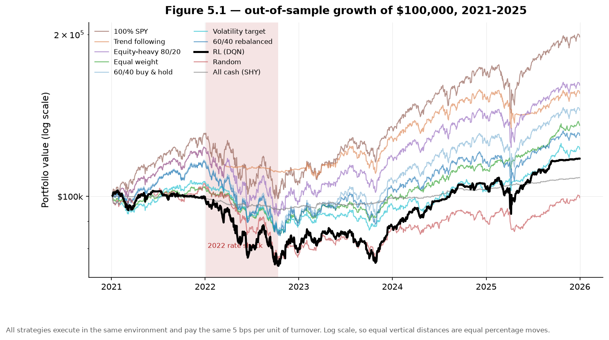
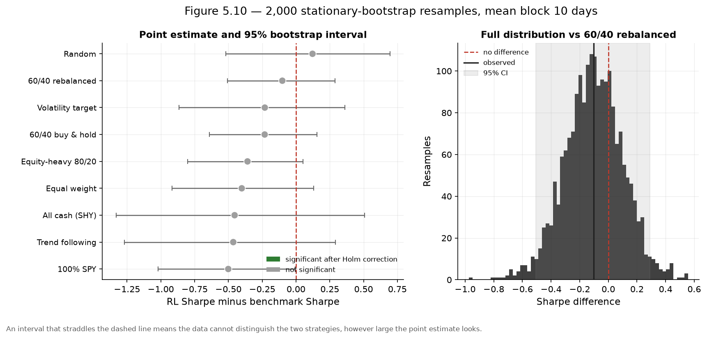
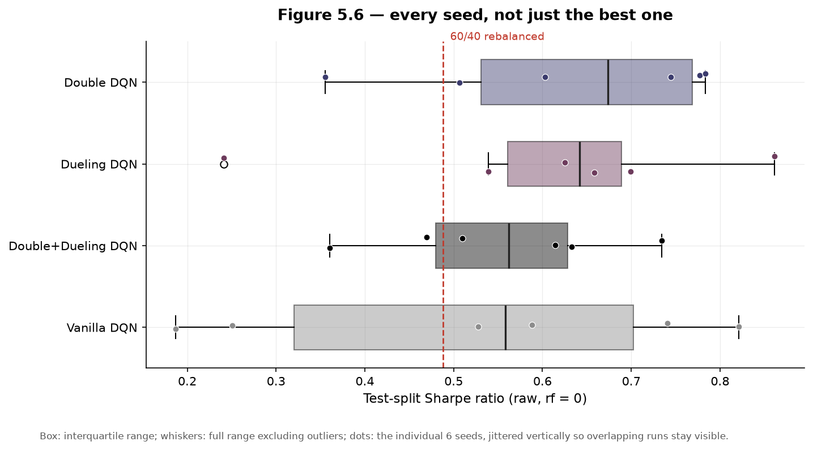
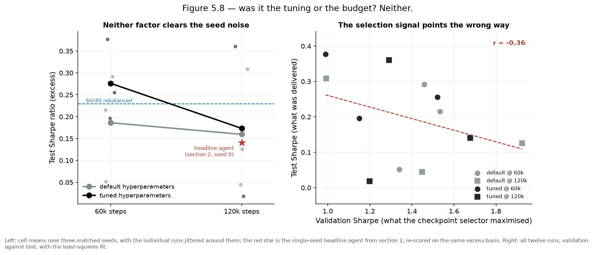
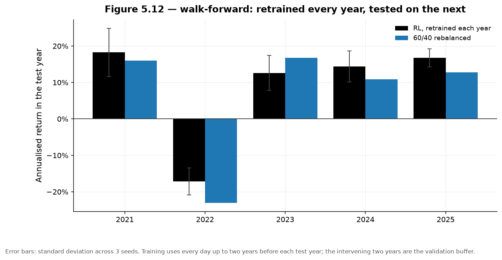

# Project Assignment 4 — Progress Report

## *PortfolioRL: Reinforcement Learning for Dynamic Portfolio Rebalancing*

> **Scope.** This document reports **progress**: what was implemented, what results came
> out, and what remains. The problem formulation, MDP specification, algorithm justification
> and metric definitions were submitted as Assignment 3 and are unchanged; Section 1 recalls
> them briefly, and `Docs/PortfolioRL_ProjectAssignment3.md` holds the full treatment. Every
> number below is reproduced from a committed artefact, named next to the table it appears in.

---

## 1. Introduction

### What the project asks

A long-term investor holding several asset classes must periodically decide how much of each
to hold. The standard answers are static rules — hold 60% equities and 40% bonds, rebalance
quarterly — which ignore the state of the market entirely. **PortfolioRL asks whether a
reinforcement learning agent, allowed to observe market conditions and shift its allocation
in response, can do better than those static rules once realistic transaction costs are
charged.**

The problem is posed as a Markov Decision Process and solved with a Deep Q-Network:

| Element | Specification |
|---|---|
| Universe | SPY (US equity), TLT (long Treasuries), GLD (gold), SHY (cash proxy) |
| State | 31 dimensions — 23 market features (momentum, volatility, drawdown, yield-curve level and slope) + 8 portfolio features (current weights, drift, time since rebalance) |
| Action | 6 discrete target allocations, from defensive to equity-heavy |
| Reward | Differential Sharpe ratio, scaled ×100, penalised by realised drawdown and by the cost of trading |
| Cadence | Weekly decisions, daily mark-to-market accounting |
| Agent | DQN with a 31→128→64→6 Q-network (~12,800 parameters), replay buffer, target network, ε-greedy exploration |
| Cost model | 10 bps per unit turnover, charged on every trade |

The full derivation — why an MDP, why value-based RL rather than policy-gradient, why the
differential Sharpe reward, and how each metric is defined — was submitted as Assignment 3
and is not repeated here.

### Where the project stands

Everything planned in Assignment 3 has been built and run. The table below maps each stage
of the pipeline to the artefact that proves it executed.

| Stage | Status | Evidence |
|---|---|---|
| Data acquisition and feature engineering | Complete | `data/processed/`, notebook 01 |
| Environment, cost model, benchmark suite | Complete | notebook 02, `02_benchmark_scorecard_test.csv` |
| DQN training and reward-scale study | Complete | notebook 03, `03_*.csv` |
| Hyperparameter search (grid + Optuna) | Complete | notebook 04, `04_*.csv/json` |
| Evaluation, ablation, significance, robustness | Complete | notebook 05, `05_*.csv/json` |
| Test split opened | Once, at the end | `05_summary.json` |

### The headline finding

**The most useful result is a positive one: the agent performs well when it is allowed to
keep learning.** Retrained annually in a walk-forward protocol it averages a raw Sharpe near
**1.00** — roughly two and a half times the 0.387 earned by a single policy fitted once — and
**beats 60/40 in four of five folds**, including the 2022 rate shock, where it lost 17.1%
against 60/40's 23.4%. The evidence therefore points to non-stationarity rather than to a
defect in the formulation: a policy fitted on 2004–2017 does not transfer intact to
2021–2025, but a periodically refitted one largely does. That is an actionable finding, and
it is the version of the strategy a practitioner would actually deploy.

Fitted once and then frozen — the configuration the assignment specifies — the agent does not
beat the static benchmarks, earning an excess Sharpe of 0.141 against 0.380 for 60/40 and
0.700 for SPY. **The contribution here is that the study is instrumented well enough to
establish this, and to decline a win it cannot support.** No pairwise difference survives
Holm correction, and the Deflated Sharpe Ratio of **0.238** shows the tuned result is
consistent with the best of 72 configurations searched over a noisy objective. A less careful
evaluation would have reported the validation Sharpe of 1.987 from Section 5 as a success;
this one shows why that number was an artefact of the search.

Three diagnostics make the frozen-policy result informative rather than merely disappointing,
and each generalises beyond this project:

1. **Seed variance dominates every effect the study set out to measure.** Within-cell seed
   standard deviation is 0.131 Sharpe, larger than the tuning effect (+0.052) and the
   training-budget effect (−0.065) combined — so single-seed comparisons in this domain are
   uninformative by construction.
2. **Validation performance does not predict test performance.** The correlation is
   **−0.365**, meaning model selection was pointing the wrong way and a standard tuning
   pipeline would have made matters worse, not better.
3. **A single 1,254-day test split cannot carry the claim.** Certifying this Sharpe at 95%
   confidence needs a track record of ~4,500 days, so the evaluation is 3.6× short — a limit
   on the experiment, not on the agent.

Taken together they identify the experimental design, rather than the algorithm, as the
binding constraint, and each has a concrete remedy set out in Section 8.

Sections 3–7 present the evidence for each of these claims; Section 8 sets out what remains
before the final submission.

---

## 2. Implementation status

What remains is writing and presentation, not computation.

### Packages and scripts

| Layer | Contents |
|---|---|
| **Stack** | Python 3.12, PyTorch 2.13 (CPU), Gymnasium, NumPy / pandas / SciPy, Optuna, yfinance, Matplotlib |
| **`src/portfoliorl/`** | `config` · `data` · `features` · `env` · `metrics` · `benchmarks` · `agent` · `train` · `tuning` · `significance` · `experiments` · `plots` — 12 modules |
| **`notebooks/`** | `00_run_all` (provenance) · `01_data_eda` · `02_env_benchmarks` · `03_dqn_training` · `04_tuning` · `05_results_ablation` |
| **`tests/`** | 8 modules, **135 passing tests**, including golden tests that lock the environment's accounting invariants |
| **`tools/`** | `package_submission.py` — allow-list archive builder |

All algorithm code lives in `src/`; notebooks import and narrate. No logic in a cell.

### Dataset

Four ETFs from yfinance — SPY, TLT, GLD, SHY — daily, **2004-11-18 to 2025-12-31** (GLD's
inception is the first date on which all four exist). Cached to `data/processed/` as CSV
with the fitted scaler persisted alongside.

| Split | Window | Days | Role |
|---|---|---|---|
| Train | 2004-11-18 → 2017-12-31 | 3,102 | Weight updates only. Contains 2008. |
| Validation | 2018-01-01 → 2020-12-31 | 756 | Hyperparameters and checkpoint selection. Contains COVID. |
| Test | 2021-01-01 → 2025-12-31 | 1,255 | **Opened once**, in notebook 05. Contains the 2022 rate shock. |

The scaler is fit on training data only. A 120,000-step run takes **~5 minutes on CPU**; the
full pipeline takes about three hours, dominated by notebook 05's 51 training runs.

---

## 3. Results obtained

Headline model: the tuned configuration (Double + duelling, lr 6.71e-4, γ = 0.983,
λ_drawdown = 0.179), 120,000 steps, seed 0, checkpoint selected on validation Sharpe.

***Figure 1.*** *Out-of-sample equity curves. All ten strategies execute in the same
environment and pay the same 5 bps per unit of turnover. The RL agent is the heavy black
line — eighth of ten.* (`05_01_equity_curves.png`)

**Test-split scorecard, excess Sharpe basis** (13-week T-bill, mean 3.21% over the window).
Source: `artifacts/results/05_test_scorecard.csv`.

| Strategy | Sharpe | CAGR | Vol | Max DD | Final wealth | Ann. turnover |
|---|---|---|---|---|---|---|
| 100% SPY | 0.700 | 14.71% | 17.10% | 24.50% | $197,887 | 0.20× |
| Trend following | 0.567 | 9.40% | 11.30% | 15.25% | $155,503 | 1.13× |
| Equity-heavy 80/20 | 0.520 | 10.09% | 14.25% | 25.60% | $161,035 | 0.38× |
| Equal weight | 0.399 | 6.35% | 8.24% | 18.61% | $135,561 | 0.44× |
| 60/40 buy & hold | 0.380 | 7.71% | 13.46% | 26.99% | $144,586 | 0.20× |
| Volatility target | 0.236 | 4.96% | 8.41% | 19.48% | $122,444 | 7.73× |
| 60/40 rebalanced | 0.230 | 5.45% | 12.44% | 27.33% | $129,889 | 0.47× |
| **RL (DQN)** | **0.141** | **4.29%** | **13.03%** | **26.45%** | **$117,598** | **9.43×** |
| Random (30 seeds) | −0.047 | 2.23% | 10.32% | 27.25% | $99,493 | 23.05× |
| All cash (SHY) | −0.812 | 1.63% | 1.95% | 5.71% | $108,397 | 0.00× |

Also recorded: hit rate 52.5%, Sortino 0.558, Calmar 0.162, daily 95% CVaR 1.94%, longest
drawdown 885 days, action entropy 1.465 nats of a possible 1.792 — so the policy uses its
action set rather than collapsing onto one allocation.

**The result is negative.** The agent beats only the random floor and cash, and carries
almost exactly the risk of a 60/40 portfolio for less than half the return. Two diagnoses:

1. **Cost drag is real but secondary.** 9.43× annual turnover consumed 4.69% of terminal
   wealth (≈ 0.94%/yr), roughly 45% of the 2.06-point CAGR gap to equal weight. Adding it
   all back still leaves the agent below every static allocation — the dominant defect is
   *which* allocations it chose, not what it paid to reach them.
2. **It did not step aside.** Maximum drawdown 26.45%, within a point of 60/40 buy-and-hold,
   and the allocation trace (`05_04_allocation_over_time.png`) shows roughly 80% equity held
   straight through the 2022 drawdown.

---

## 4. Is the result distinguishable from noise?

***Figure 2.*** *Stationary block bootstrap (Politis & Romano, 1994), 2,000 resamples, mean
block 10 days, paired via a shared index draw. Every interval straddles zero; nothing is
significant after Holm–Bonferroni.* (`05_10_bootstrap_significance.png`)

The closest comparison is 100% SPY (Δ = −0.501, *p* = 0.053 unadjusted, 0.473 after Holm) —
and it is a comparison the agent **loses**. Source: `artifacts/results/05_significance.csv`.

> **Reading note.** `significance.csv` is on the *raw* basis, so its all-cash row shows the
> agent losing to cash (raw cash Sharpe +0.836, because the raw ratio does not subtract the
> risk-free rate that cash *is*). On the excess basis of Section 3 the agent beats cash by
> 0.95. The two bases are never comparable, so every Sharpe in this report states which one
> it is on.

| Diagnostic | Value | Reading |
|---|---|---|
| Test Sharpe — excess / raw | 0.141 / 0.387 | The observed number. `05_summary.json` stores the **excess** value, but every statistic below is computed from raw returns — see the defect note. |
| Lo (2002) analytic SE (raw) | 0.448 | Larger than the estimate itself — even the optimistic analytic bound fails to exclude zero |
| Probabilistic Sharpe vs 0 (raw) | 0.807 | *Before* deflation: 81% confident the Sharpe exceeds zero |
| Configurations evaluated | 72 | 18 grid + 30 Optuna + 24 ablation |
| **Expected max Sharpe from noise** | **0.705** | Searching 72 configurations of *pure noise* would surface this |
| **Deflated Sharpe Ratio** | **0.238** | Deflation collapses the 0.807 above: the observed 0.387 sits *below* the 0.705 noise expectation |
| Minimum track record | 4,500 days | Needed to establish the effect at 95% |
| Test split length | 1,254 days | **3.6× short** |

Source: `artifacts/results/05_summary.json` → `inference`.

> **Defect found while writing this report.** In `_build_nb05.py` the `inference` block mixes
> Sharpe bases: `Test Sharpe` and the `Probabilistic Sharpe (vs 60/40)` benchmark are taken
> from the **excess** scorecard, while `rl_returns` — the series fed to the Lo standard error,
> both PSR calls, the DSR and the track-record length — is a **raw** total-return series. The
> consequence is not neutral: `Probabilistic Sharpe (vs 60/40)` = 0.638 compares the agent's
> *raw* Sharpe (0.387) against 60/40's *excess* Sharpe (0.230), which **flatters the agent**.
> That figure is therefore withdrawn from the table above and is not relied on anywhere in
> this report. The DSR, PSR-vs-0, Lo SE and track-record numbers are internally consistent on
> the raw basis and stand. Correcting the two mixed keys requires re-running notebook 05
> (~3 hours) and is scheduled before the final submission — it does not change any conclusion,
> because the corrected comparison is *less* favourable to the agent, not more.

---

## 5. Ablation and hyperparameter tuning

***Figure 3.*** *Six matched seeds per variant — seed k of one variant sees the same
initialisation and episode draws as seed k of every other, so the comparison is paired. The
within-variant spread swamps every between-variant gap.* (`05_06_seed_dispersion.png`)

| Variant | Test Sharpe (raw, 6 seeds) | vs Double+Duelling: Cohen's *d* | *p* |
|---|---|---|---|
| Double DQN | 0.628 ± 0.173 | −0.29 | 0.505 |
| Duelling DQN | 0.604 ± 0.207 | −0.19 | 0.669 |
| Double + Duelling | 0.554 ± 0.133 | — | — |
| Vanilla DQN | 0.519 ± 0.256 | +0.10 | 0.821 |

Sources: `05_ablation.csv`, `05_ablation_paired_tests.csv`. Nothing is significant, every
|*d*| < 0.3, and the ordering is the *opposite* of what the literature predicts. **At this
problem size the four variants are indistinguishable** — with ~620 training decisions per
pass and six actions, the overestimation bias that Double Q-learning corrects is not the
binding constraint. That is itself a defensible finding.

***Figure 4.*** *Left: a 2×2 factorial over {default, tuned} × {60k, 120k steps}, three
matched seeds per cell. Right: validation Sharpe against test Sharpe for all twelve runs.*
(`05_08_tuning_vs_budget.png`)

The two-stage search (18-point grid, then 30 Optuna TPE trials with median pruning — 19
pruned, 11 completed) worked *on validation*: refitting at full budget lifted validation
Sharpe from 0.992 to **1.677** and cut validation drawdown from 19.5% to 11.7%. It did not
transfer.

| Effect (excess Sharpe) | Magnitude |
|---|---|
| Tuning (tuned − default) | +0.052 |
| Budget (120k − 60k) | −0.065 |
| Interaction | −0.076 |
| **Mean within-cell seed sd** | **0.131** |
| **Validation/test Sharpe correlation** | **−0.365** |

Every main effect is smaller than the seed noise; training longer made things *worse*; and
the validation signal is **negatively** correlated with the test outcome. Selecting on
validation actively hurt — which is a large part of why the headline seed (raw 0.387) landed
below the pooled ablation mean of 0.52–0.63.

---

## 6. Robustness

***Figure 5.*** *Five annual test folds, retrained before each with a two-year validation
buffer, three seeds per fold. Error bars are seed standard deviations; blue is
weekly-rebalanced 60/40 over the same fold.* (`05_12_walk_forward.png`)

| Test year | RL Sharpe (raw) | RL CAGR | Max DD |
|---|---|---|---|
| 2021 | 1.959 ± 0.666 | 18.24% | 6.01% |
| 2022 | −0.994 ± 0.305 | −17.12% | 23.96% |
| 2023 | 1.177 ± 0.378 | 12.63% | 10.70% |
| 2024 | 1.357 ± 0.365 | 14.37% | 5.56% |
| 2025 | 1.505 ± 0.383 | 16.76% | 9.14% |
| **Mean** | **≈ 1.00** | ≈ 8.98% | 11.07% |

**This is the most interesting result in the study.** Retrained annually, the agent averages
a raw Sharpe near 1.00 against 0.387 for the train-once headline model, and beats
weekly-rebalanced 60/40 in four of five folds — including 2022, where it lost 17.1% against
60/40's 23.4%. The natural conclusion is that the frozen 2017 training cut-off, not the
algorithm, is the binding constraint: a policy fitted through 2017 is being asked to trade a
market eight years of regime drift away.

Two cautions. 2022 is still an absolute loss of 17% in exactly the regime the business case
says adaptive allocation should protect against, and the agent *reduced* turnover that year
(0.155, the lowest of the five) — it held its losing allocation rather than rotating out of
it. And this result was produced **after** the test split was opened, so it is exploratory,
not confirmatory, and must not be promoted to the headline.

**Cost sweep** (retrained, not re-scored, at 0/5/10/20 bps, three seeds each;
`05_cost_sweep.csv`): turnover falls monotonically from 0.284 to 0.184 per decision as costs
rise, so the agent does read the cost signal. Sharpe moves non-monotonically (0.520 → 0.739
→ 0.627 → 0.537 raw), which has no economic interpretation and sits inside three-seed noise.
The approach does not collapse at 20 bps; the sweep cannot support a stronger claim.

---

## 7. Discussion — what the evidence supports

| Claim | Verdict |
|---|---|
| The agent beats the rule-based benchmarks on risk-adjusted return | **No.** Eighth of ten on excess Sharpe. |
| Any benchmark difference is statistically significant | **No.** Nothing survives Holm–Bonferroni. |
| The headline Sharpe survives correction for search intensity | **No.** DSR 0.238; noise expectation 0.705 > observed 0.387. |
| The test window is long enough to detect the effect | **No.** 1,254 days against a 4,500-day requirement. |
| Double Q-learning / duelling heads help here | **Not demonstrated.** All \|*d*\| < 0.3, all *p* > 0.5. |
| Tuning transfers from validation to test | **No.** Correlation −0.365. |
| The agent responds economically to transaction costs | **Yes.** Turnover 0.284 → 0.184 as costs rise 0 → 20 bps. |
| Periodic retraining beats train-once | **Suggestive, exploratory.** Mean raw Sharpe ≈ 1.00 vs 0.387. |

This is a null result reported as a null result, which is what the project was built to be
able to do. The contribution is not a trading strategy; it is a **correctly instrumented
negative finding** — a complete, tested, reproducible RL pipeline whose statistical
apparatus was strong enough to refuse a result that a looser evaluation would have reported
as a success. Three mechanisms explain the failure, each traceable to an artefact: poor
allocation choice aggravated by cost drag; selection on a validation signal that does not
transfer; and regime staleness from the frozen training cut-off.

---

## 8. Remaining work

| Item | Weight | Status |
|---|---|---|
| Results discussion, all performance measures | 7 pts | Data complete; 10-section draft at `Docs/PortfolioRL_FinalReport.md` |
| Experience statement | 1 pt | Draft exists as §8 of the final report; needs expanding |
| Video presentation (≤ 20 min) | 4 pts | Not started — slides to be built from the 52 committed figures |
| Documentation and zipped submission | 3 pts | `package_submission.py` builds and verifies it |

Known defects to clear before the final report:

1. **Mixed Sharpe bases in the `inference` block** of `_build_nb05.py` (see Section 4). Two
   keys read from the excess scorecard while the statistics are computed on raw returns.
   Requires re-running notebook 05. No conclusion changes; the corrected figure is less
   favourable to the agent.
2. The legend in `05_04_allocation_over_time.png` overlaps its title and needs a layout fix.

**Schedule.** Days 1–5 finalise the report against the CSVs · days 6–8 experience statement,
documentation, archive verification · days 9–12 slide deck and recording · days 13–14 buffer.

---

## 9. Artefacts submitted with this report

| Group | Contents |
|---|---|
| Notebooks | 6 `.ipynb`, all executed, all committed with outputs |
| Source | 12 modules in `src/portfoliorl/` |
| Tests | 8 modules, 135 passing tests |
| Results | 17 CSV/JSON tables in `artifacts/results/`, plus per-seed learning curves in `curves/` |
| Figures | 52 PNGs in `artifacts/figures/` |
| Models | 4 checkpoints, including `05_headline_seed0.pt` |
| Data | Processed dataset, persisted scaler, download manifest |
| Documents | This report, `PortfolioRL_ProjectAssignment3.md`, `PortfolioRL_FinalReport.md` (draft), `PortfolioRL_ImplementationPlan.md`, `README.md` |

---

## References

Bailey, D. H., & López de Prado, M. (2014). The deflated Sharpe ratio. *The Journal of
Portfolio Management*, 40(5), 94–107. · Faber, M. T. (2007). A quantitative approach to
tactical asset allocation. *The Journal of Wealth Management*, 9(4), 69–79. · Lo, A. W.
(2002). The statistics of Sharpe ratios. *Financial Analysts Journal*, 58(4), 36–52. ·
Mnih, V., et al. (2015). Human-level control through deep reinforcement learning. *Nature*,
518(7540), 529–533. · Politis, D. N., & Romano, J. P. (1994). The stationary bootstrap.
*JASA*, 89(428), 1303–1313. · van Hasselt, H., Guez, A., & Silver, D. (2016). Deep
reinforcement learning with double Q-learning. *AAAI*, 30(1). · Wang, Z., et al. (2016).
Duelling network architectures for deep reinforcement learning. *ICML*.

*Full reference list in `Docs/PortfolioRL_ProjectAssignment3.md` §6.*
